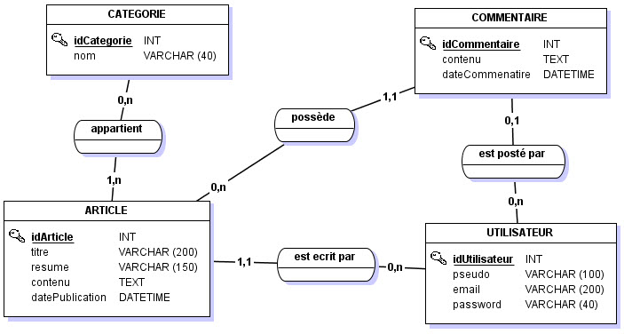
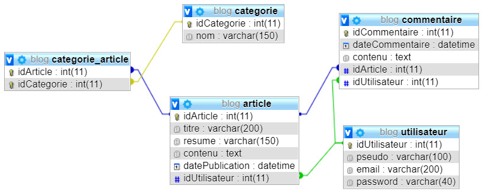

# Programmation SQL

Savoir programmer des objets SQL, c'est pouvoir alléger le développement mais aussi garantir des fonctionnaités impactant l'intégrité des données à tout instant, quel que soit le programme qui viendrait les modifier :-)

Pour cette étude, partons sur un nouveau projet ...

## Etape 1 : Conception

Votre mission pour ce nouveau projet est de créer une base de données d’un site de blog.

Voici les informations nécessaires à la création de la base de données :

Il s’agit donc d’un blog.
Sur ce blog sont publiés des <b>articles</b>, composé d’un <b>titre</b>, d’un <b>texte</b> et d’un <b>résumé</b> (ou extrait).
Ils sont écrits par des <b>utilisateurs</b> (<b>pseudo, email, mot de passe</b>).

Les articles doivent appartenir à au moins une <b>catégorie</b>.
Chaque catégorie est composée d’un <b>nom</b> et d’une <b>description</b>.

Il est possible de commenter les articles.
Si le commentateur est un utilisateur enregistré, le <b>commentaire</b> est lié à son compte.
Mais il est aussi possible de commenter un article sans être connecté, sans même avoir de compte.

Sur la page d’accueil, les articles sont affichés (titre, date, auteur et résumé).
Ils sont triés par <b>date de publication</b>.

En dehors de la page principale, il existe trois types de pages :

- une page utilisateur, reprenant les articles écrits par un utilisateur triés par date,
- une page catégorie, qui affiche les articles d’une catégorie, également triés par date,
- et enfin une page article, qui affiche un article complet ainsi que ses commentaires par ordre chronologique.

Merci de relever ce nouveau défi !

___

## Etape 2 : Préparation de la base

A partir des informations ci-dessus, la précédente ésuipe de développeurs, dont vous reprenez le travail, a conçu le MCD suivant :

Pour commencer, créez une base de données MySql et importer le script suivant : [blog.sql](blog.sql)

Vous devez obtenir le schéma physique suivant :

___

## Etape 3 : programmons dans la bdd !

### Exercice 1 : FONCTION

Créer une fonction « DateFrench » qui permet d’afficher une date de type « datetime » au format français DD/MM/YYYY. Ex : 13/04/2018.

> Mots clés : DATE_FORMAT, CREATE FUNCTION ...

### Exercice 2 : VUE

Afin d’afficher la liste des derniers articles sur la page d’accueil, créez une vue « vueArticles » qui retourne l’identifiant, la date de publication (format français), le pseudo de l’auteur, le titre et le résumé de chaque article (triés du plus récent au plus vieux). Sans oublier le nombre de commentaires liés à ces articles.

> Mot clé : CREATE VIEW ...

### Exercice 3 : PROCEDURE STOCKEE

Pour afficher un article en particulier sur une page du blog, créez une procédure stockée « psArticle » qui retourne l’article complet : titre, résumé, contenu, date de publication au format français et pseudo de l’auteur.

> Mot clé : CREATE PROCEDURE ...

L'intérêt de créer une proc sto est de pouvoir regrouper plusieurs actions au sein d'un seul bloc de code SQL. Par exemple, trouvez une solution qui permettent de comptabiliser le nombre de lecture d'un article ... Indication : Vous aurez probablement besoin d'ajouter une colonne à la table articles.

### Exercice 4 : TRIGGER

Les auteurs d’articles n’écrivent pas systématiquement un résumé de leur article.
Créez donc deux Trigger « trArticlesBeforeInsert » et « trArticlesBeforeUpdate » sur ajout et sur modification d’un article pour créer automatiquement un résumé en prenant les 150 premiers caractères de l’article, si l’auteur n’en a pas écrit.

> Mot clé : CREATE TRIGGER ...
